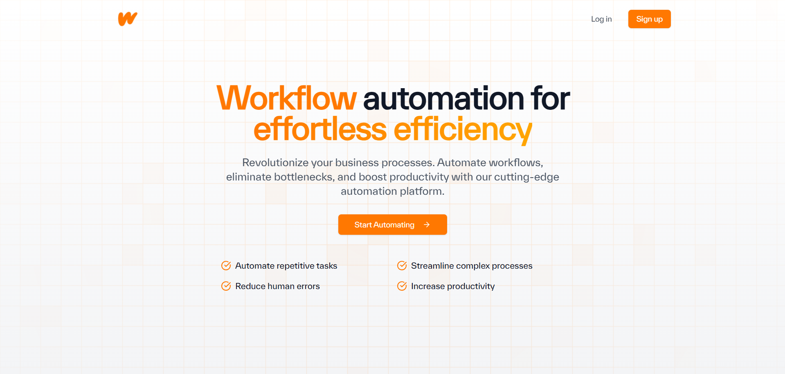

# [Workflow Automation](https://workflows-flax.vercel.app)



> Automate your Workflows with ease

## Solution

Workflow Automation enables seamless automation of your workflows. Users can effortlessly create workflows and configure them to the available trigger providers and multiple available actions with precision. Designed with a robust event-driven architecture, the application ensures reliable and asynchronous execution of actions upon each trigger, providing high performance.

## Features

- Streamlined Worflow Creation
- Webhook trigger provider
- Automate your Google Sheet
- Mailing service for instant mails
- Clean and MVC OOPs architecture
- Secure Clerk Authentication and Authorization
- Beautiful User Interface
- React Flow for User-Friendly Experience


## System Architecture


## DB Diagram


## Tech Stack

### Backend
- **PostgerSQL** - SQL database for storing data and maintain complex data relations
- **Prisma** - Efficient ORM for database interactions
- **Redis** - In-memory database and queue management
- **Node.js** - JavaScript runtime for server-side development
- **Express** - Web framework for Node.js
- **Nodemailer** - For sending emails

### Frontend
- **Next.js** - React framework for production
- **TypeScript** - Superset of JavaScript for type safety
- **Tailwind CSS** - Utility-first CSS framework
- **React Flow** - React library to built user friendly workflows

### Deployment
- **Render** - Deployment platform for backend services
- **Vercel** - Deployment platform for frontend

## Deployment Links

- Frontend: [Workflow Automation](https://workflows-flax.vercel.app)
- Backend: [Backend Server](https://automate-workflow-backend.onrender.com)
- Webhook: [Webhook Server](https://workflow-hooks.onrender.com)
- Worker: [Worker Server](https://workflow-worker-o8lo.onrender.com)

## Solution Future Aspects

- Add more Trigger and Action provider to expand the Workflow Automation
- Provide user to connect with the provider to reduce manual workload
- Add notification channels (Slack, Discord)
- Integrate AI for enhanced workflow automation
- Create a Webhook secret key to authenticate and secure the Webhook endpoint

## Pros and Cons of Proposed Solution

### Pros
- Streamlined and user-friendly interface
- Event-driven asynchronous processing
- Clean architecture with a fallback mechanism
- MVC OOPs backend codebase architecture

### Cons
- Transition to microservices architecture
- Securing the Webhook endpoint using unique secret key

## Getting Started

### Installation

1. Clone the repository:

    ```
    git clone https://github.com/Shreekar11/Automate-Workflow.git
    ```

2. Navigate to the project directory:

    ```
    cd Automate-Workflow
    ```

### Running Frontend

1. Navigate to the project directory:

    ```
    cd frontend
    ```


2. Install dependencies:

    ```
    npm install
    ```

3. Create a `.env` file in the root directory and add your environment variables:

    ```
    NEXT_PUBLIC_CLERK_PUBLISHABLE_KEY=
    CLERK_SECRET_KEY=
    NEXT_PUBLIC_CLERK_SIGN_IN_URL=
    NEXT_PUBLIC_CLERK_SIGN_UP_URL=
    NEXT_PUBLIC_CLERK_AFTER_SIGN_IN_URL=
    NEXT_PUBLIC_CLERK_AFTER_SIGN_UP_URL=
    WEBHOOK_SECRET=
    NEXT_PUBLIC_BASE_URL=
    NEXT_PUBLIC_WEBHOOK_URL=
    ```

4. Run the frontend:

    ```
    npm run dev
    ```

5. Open [http://localhost:3000](http://localhost:3000) in your browser to see the application.

### Running Backend Server

1. Create a `.env` file in the root directory and add your environment variables:

    ```
    DATABASE_URL=
    CLERK_PUBLISHABLE_KEY=
    CLERK_SECRET_KEY=
    BACKEND_URL=
    FRONTEND_URL=
    ```

2. Navigate to the backend directory and start the server:

    ```
    cd backend
    npm install
    npm run dev
    ```

3. Server will run on endpoint :- [http://localhost:8080](http://localhost:8080) 

### Running Webhook Server

1. Create a `.env` file in the root directory and add your environment variables:

    ```
    DATABASE_URL=
    WEBHOOK_URL=
    REDIS_URL=
    FRONTEND_URL=
    ```

2. Install Redis using Docker, run the below Docker command to pull the redis docker image: 

    ```
    docker run -d --name redis-queue -p 6379:6379 -p 8001:8001 redis/redis-stack:latest
    ```

3. Navigate to the hooks directory and start the server:

    ```
    cd hooks
    npm install
    npm run dev
    ```

### Running Worker Server

1. Create a `.env` file in the root directory and add your environment variables:

    ```
    DATABASE_URL=
    MAIL_USERNAME=
    MAIL_PASSWORD=
    GOOGLE_CLIENT_EMAIL=
    GOOGLE_PRIVATE_KEY=
    WORKER_URL=
    REDIS_URL=
    ```

2. Navigate to the worker directory and start the server:

    ```
    cd worker
    npm install
    npm run dev
    ```

## Run the project via **Docker**

## Prerequisites

- Docker

## For Linux System:

To install Docker, run the following commands in your terminal:

    ```
    curl -fsSL https://get.docker.com -o get-docker.sh
    sudo sh get-docker.sh
    ```

## Development Environment For Server

- Navigate into **backend** directory
- To get started with development first build the dev containers using the following command

    ```bash
    docker-compose build
    ```

- The env file being used for development is called `.env`
- Run the containers using the command

    ```bash
    docker-compose -up
    ```

## Development Environment For Client

- Navigate into **frontend** directory
- To get started with development first build the dev containers using the following command

    ```bash
    docker-compose build
    ```

- The env file being used for development is called `.env`
- Run the containers using the command

    ```bash
    docker-compose -up
    ```

- Navigate into **hooks** directory
- To get started with development first build the dev containers using the following command

    ```bash
    docker-compose build
    ```

- The env file being used for development is called `.env`
- Run the containers using the command

    ```bash
    docker-compose -up
    ```

- Navigate into **worker** directory
- To get started with development first build the dev containers using the following command

    ```bash
    docker-compose build
    ```

- The env file being used for development is called `.env`
- Run the containers using the command

    ```bash
    docker-compose -up
    ```

## Contact

For any inquiries or support, please email us at shreekargade2004@gmail.com or open an issue in this repository.

Enjoy your workflow automation process!⚒️🚀