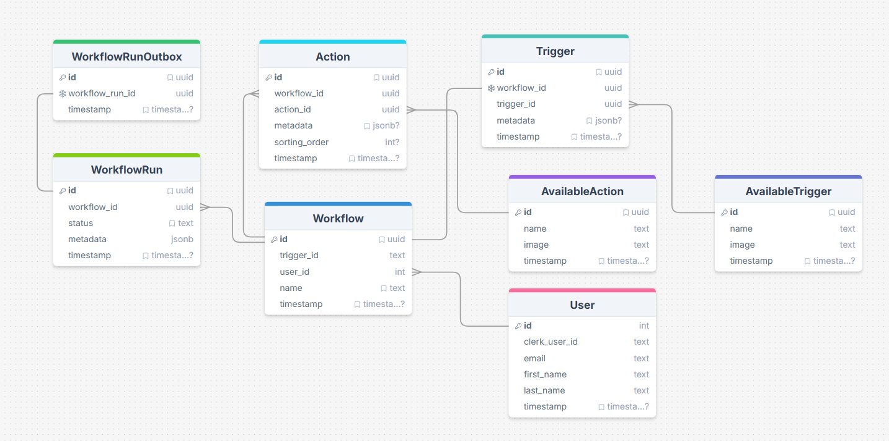

# [Workflow Automation](https://workflows-flax.vercel.app)


> Automate your Workflows with ease

## Solution

Workflow Automation is an advanced platform for seamless workflow creation and management. It enables users to effortlessly design and configure automated workflows using diverse trigger providers and multiple actions, leveraging a robust event-driven architecture for reliable and asynchronous execution.

## Key Features

- Intuitive Workflow Creation Interface
- Webhook Integration
- Google Sheets Automation
- Advanced Mailing Services
- Clean and Modular Architecture
- Secure Clerk Authentication and Authorization
- Responsive User Interface

## System Architecture


## Database Schema



## Tech Stack

### Backend
- **PostgreSQL**: Robust SQL database for complex data relations
- **Prisma**: Efficient ORM for database interactions
- **Redis**: In-memory database and queue management
- **Node.js**: Server-side JavaScript runtime
- **Express**: Lightweight web framework
- **Nodemailer**: Email transmission service

### Frontend
- **Next.js**: React framework for production
- **TypeScript**: Enhanced JavaScript with type safety
- **Tailwind CSS**: Utility-first styling framework

### Deployment
- **Render**: Backend service hosting
- **Vercel**: Frontend deployment platform

## Deployment Links

- Frontend: [Workflow Automation](https://workflows-flax.vercel.app)
- Backend: [Backend Server](https://automate-workflow-backend.onrender.com)
- Webhook: [Webhook Server](https://workflow-hooks.onrender.com)
- Worker: [Worker Server](https://workflow-worker-o8lo.onrender.com)

## Future Roadmap

- Expand trigger and action provider ecosystem
- Implement direct provider integrations
- Add notification channels (Slack, Discord)
- Integrate AI for enhanced workflow automation
- Explore microservices architecture

## Solution Evaluation

### Strengths
- User-friendly, intuitive interface
- Event-driven asynchronous processing
- Modular, clean architectural design
- Robust backend with fallback mechanisms

### Improvement Opportunities
- Transition to microservices architecture
- Enhance caching mechanisms
- Develop more comprehensive fallback strategies


## Getting Started

### Installation

1. Clone the repository:

    ```
    git clone https://github.com/Shreekar11/Automate-Workflow.git
    ```

2. Navigate to the project directory:

    ```
    cd Automate-Workflow
    ```

### Running Frontend

1. Navigate to the project directory:

    ```
    cd frontend
    ```


2. Install dependencies:

    ```
    npm install
    ```

3. Create a `.env` file in the root directory and add your environment variables:

    ```
    NEXT_PUBLIC_CLERK_PUBLISHABLE_KEY=
    CLERK_SECRET_KEY=
    NEXT_PUBLIC_CLERK_SIGN_IN_URL=
    NEXT_PUBLIC_CLERK_SIGN_UP_URL=
    NEXT_PUBLIC_CLERK_AFTER_SIGN_IN_URL=
    NEXT_PUBLIC_CLERK_AFTER_SIGN_UP_URL=
    WEBHOOK_SECRET=
    NEXT_PUBLIC_BASE_URL=
    NEXT_PUBLIC_WEBHOOK_URL=
    ```

4. Run the frontend:

    ```
    npm run dev
    ```

5. Open [http://localhost:3000](http://localhost:3000) in your browser to see the application.

### Running Backend Server

1. Create a `.env` file in the root directory and add your environment variables:

    ```
    DATABASE_URL=
    CLERK_PUBLISHABLE_KEY=
    CLERK_SECRET_KEY=
    BACKEND_URL=
    FRONTEND_URL=
    ```

2. Navigate to the backend directory and start the server:

    ```
    cd backend
    npm install
    npm run dev
    ```

### Running Webhook Server

1. Create a `.env` file in the root directory and add your environment variables:

    ```
    DATABASE_URL=
    WEBHOOK_URL=
    REDIS_URL=
    FRONTEND_URL=
    ```

2. Install Redis using Docker, run the below Docker command to pull the redis docker image: 

    ```
    docker run -d --name redis-queue -p 6379:6379 -p 8001:8001 redis/redis-stack:latest
    ```

3. Navigate to the hooks directory and start the server:

    ```
    cd hooks
    npm install
    npm run dev
    ```

### Running Worker Server

1. Create a `.env` file in the root directory and add your environment variables:

    ```
    DATABASE_URL=
    MAIL_USERNAME=
    MAIL_PASSWORD=
    GOOGLE_CLIENT_EMAIL=
    GOOGLE_PRIVATE_KEY=
    WORKER_URL=
    REDIS_URL=
    ```

2. Navigate to the worker directory and start the server:

    ```
    cd worker
    npm install
    npm run dev
    ```

## Run the project via **Docker**

## Prerequisites

- Docker

## For Linux System:

To install Docker, run the following commands in your terminal:

    ```
    curl -fsSL https://get.docker.com -o get-docker.sh
    sudo sh get-docker.sh
    ```

## Development Environment For Server

- Navigate into **backend** directory
- To get started with development first build the dev containers using the following command

    ```bash
    docker-compose build
    ```

- The env file being used for development is called `.env`
- Run the containers using the command

    ```bash
    docker-compose -up
    ```

## Development Environment For Client

- Navigate into **frontend** directory
- To get started with development first build the dev containers using the following command

    ```bash
    docker-compose build
    ```

- The env file being used for development is called `.env`
- Run the containers using the command

    ```bash
    docker-compose -up
    ```

- Navigate into **hooks** directory
- To get started with development first build the dev containers using the following command

    ```bash
    docker-compose build
    ```

- The env file being used for development is called `.env`
- Run the containers using the command

    ```bash
    docker-compose -up
    ```

- Navigate into **worker** directory
- To get started with development first build the dev containers using the following command

    ```bash
    docker-compose build
    ```

- The env file being used for development is called `.env`
- Run the containers using the command

    ```bash
    docker-compose -up
    ```

## Contact

For any inquiries or support, please email us at shreekargade2004@gmail.com or open an issue in this repository.

Enjoy your workflow automation process!⚒️🚀